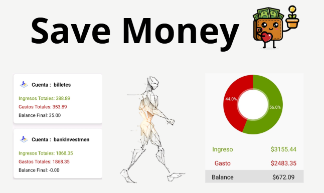
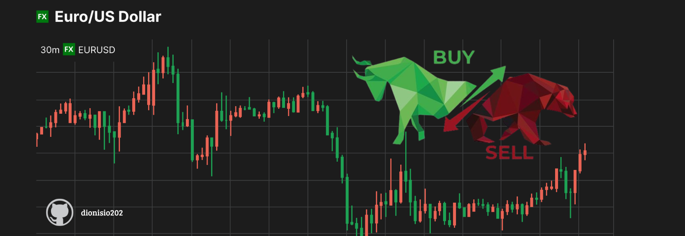

<h1 align="center">Hey 👋 What's Up? I'm Edison Ortiz 👨‍💻</h1>

  

  <h3>Software Engineer | Full Stack Developer | Process Automation (RPA) Specialist</h3>
  
🎓 Software Engineering Student at Universidad Técnica de Ambato

  
💼 Passionate about building efficient and secure web solutions

  
🧠 Interested in Artificial Intelligence and Process Automation (RPA)

---

## 🛠️ Skills

  
  
  
  
  
  
  
  
  
  
  
  
  
  
  
  
  
  
  
  
  
  
  
  
  
  
  

## 🚀 Featured Projects

<table>
  <tr>
    <td align="center" width="300">
       
      <h3>Secure Repository</h3>
      
A web platform with double-layer AES-128 encryption, advanced access control, granular permissions system, and digital signature for maximum document security.

      

    </td>
   <td align="center" width="300">
   
  <h3>Weather Prediction System</h3>
  
Web-based system using Fuzzy Logic and Association Rules to predict weather precipitation level. Includes Genetic Algorithm for feature selection and dynamic fuzzy rule generation based on real meteorological data from Weatherbit.

  
</td>

  </tr>
  <tr>
    <td align="center" width="300">
   
  <h3>Save Money App - Personal Finance Management</h3>
  
Native Android application developed in Kotlin with Supabase backend for complete personal finance management. Features interactive charts, financial calendar, and secure cloud synchronization.

  
</td>
   <td align="center" width="300">
   
  <h3>ForexRadar App (React + Django)</h3>
  

    Real-time Forex monitoring platform with interactive candlestick charts, personalized watchlist, scraping-based data collection, and user profile management.
  

  
  
</td>

  </tr>
</table>

---
## 📊 GitHub Analytics

### 📈 Development Stats

### 🔥 Streak Stats

### 📈 Contributions

### 🏆 GitHub Achievements

---

## 📬 Contact & Connect

  

---

  
  
    
  
  **Thank you for visiting my profile 👋**  
  *I am open to collaborations and new challenges!*
  

